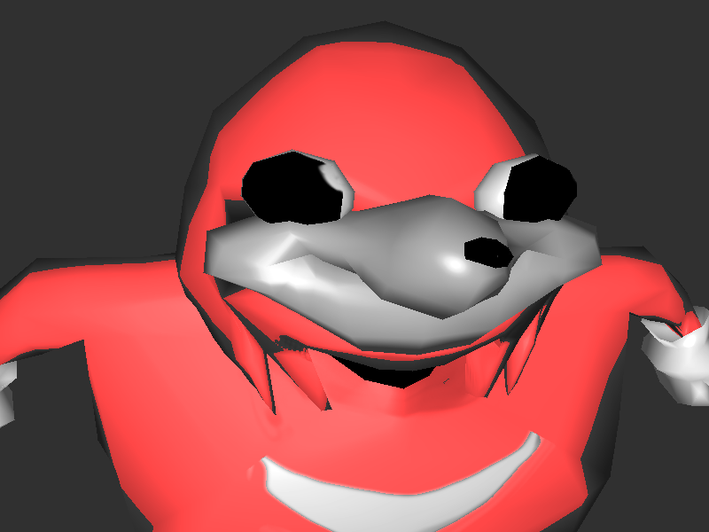
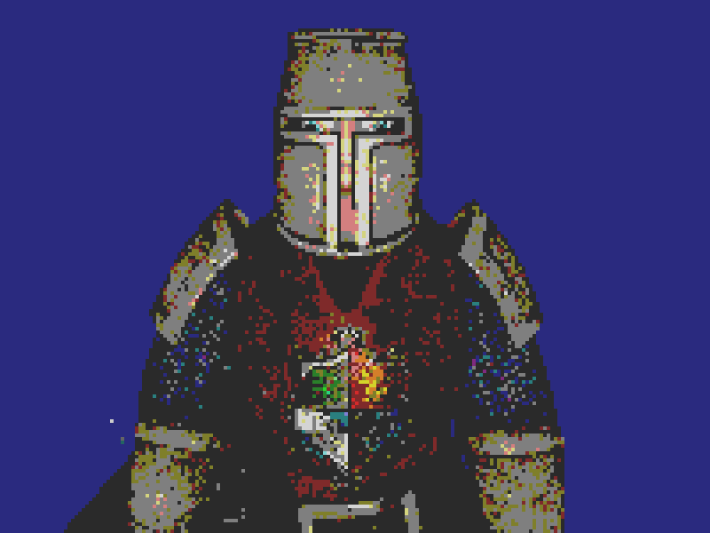
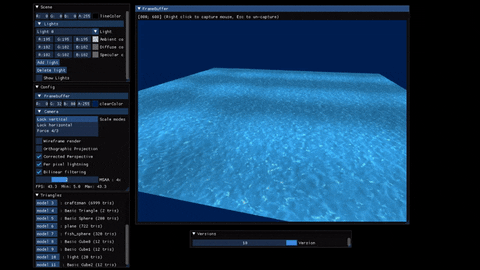
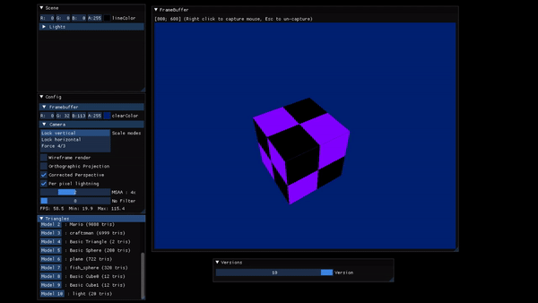

# Rasterizer project
THe goal of this project was to create a rasterizer program, running on CPU.
This project was done as a part of our 3d render engine classes.

## Summary
<ul>
    <li><a href = "#keys"> Keys </a></li>
    <li><a href = "#version"> Various Version </a></li>
    <li><a href = "#ui"> Ui </a></li>
    <li><a href = "#gallery"> Gallery </a></li>
    <li><a href = "#credits"> Credits </a></li>
</ul>

## Keys

<li><b>W A S D</b> : Move.
<li><b>Mouse</b> : Rotate Camera.
<li><b>E</b> : Fly up.
<li><b>Q</b> : Fly down.
<li><b>Left Shift</b> : go faster.
<li><b>F1</b> : Enable/Disable WireFrame.
<li><b>F2</b> : Enable/Disable MSAA filtering.

  

## Various versions

<ul>
    <li><b>Version 1</b>:  
    A triangle is displayed, with a color interpolated between the 3 points (RGB).
    <li><b>Version 2</b>:  
    A red Cube and a blue sphere are displayed to show the z-buffer.
    <li><b>Version 3</b>:  
    A red Cube and a blue sphere are displayed to show the lighting under the Phong model.
    <li><b>Version 4</b>:  
    A red Cube and a blue sphere are displayed to show the illumination under the Blinn-Phong model in per-pixels. The Cube and the Sphere are rotated in order to show the correct calculation of the normals.
    <li><b>Version 5</b>:  
    Show the projection by rendering the precedent Cube and Sphere.
    <li><b>Version 6</b>:  
    A Cube Textured is displayed to show the texturing of the triangles.
    <li><b>Version 7</b>:  
    Activate the Wireframe on the previous cube. It can be disabled with the F1 key.
    <li><b>Version 8</b>:  
    Makes a large cube opaque, and another smaller cube 50% transparent that rotates on itself.
    <li><b>Version 9</b>:  
    Renders a 3d model of a guard to show everything we've done before.
    <li><b>Version 10</b>:  
    Render a scene to show the anti-aliasing
    <li><b>In all versions</b>:  
    <ul>
        <li>All models/meshs can be displayed, change position, rotation, scale, texture, color, shader and bilinear filtering.
        <li>The MSAA value can be change.
        <li>Perspective correction can be disabled/enabled.
        <li>The wireframe can be disabled/enabled.
        <li>Orthographic vision can be disabled/enabled.
        <li>Can add Lights/Show Lights.
        </ul>
</ul>

  

## Ui

 Possiblity to change scale of every windows. 

    In the interface, the tab:
<ul>
    <li><b> Scene</b> : allows you to add lights, delete them, change the ambient, diffuse and specular parameters. The lights can have different colors and different luminosity. You can also show light.</li>
    <li><b> Config</b> : allows to display the wireFrame render, the orthographic vision, the perspective correction, the light in per pixels and you can change the MSAA value. Also displays the number of FPS. And allow you to   change the color of the background. You can also lock the scale horizontaly, verticaly and in 4/3. You can also change the filter with the slider (default : No filter). There is more than 10 filters (see in <a href = "#filter"> gallery </a>)</li>
    <li><b> Triangles</b> : Displays the number of triangles in total, and the number of triangles drawn. Also displays the number of triangles per models, When you click on a models buttons you can: see the name of the mesh, change the position, the rotation, the scale of the models, the color, the shader, and the texture. Can also choose to show or not the meshs and enable or not the bilinear filtering of every Models. There is 4 shaders (see in <a href = "#shader"> gallery </a>)
    <li> <b>Versions</b> : Allows you to change versions.</li>
    <li> <b>Framebuffer</b> : Displays the scene.</li>
</ul>

### Gallery

<ul>
    <li>

        

            

                14 filters :
            

            <ol><b>
                <li>No filter </li>
                <li>Inverted </li>
                <li>Red Only </li>
                    
                <li>Green Only 
                <li>Blue Only 
                <li>Pixelizer 
                <li>Posterize 
                <li>GBC (from GameBoy Color): 
                    </li>
                <li>UpsideDown 
                <li>GrayScale 
                <li>Hash 
                <li>VHS 
                    </li>
                <li>Pumpkin view (source: Minecraft) </li>
                <li>Creeper view (source: Minecraft) </li>
            </b></ol>
        

    
</li>
    <li> 

        

            

                4 shaders:  
            

            <ul>
                <li>Default  
                <li>Wave  
                    </li>
                <li>Cel  
                    </li>
                <li>Glitch  
                    </li>
            </ul>
        

    
</li>

### Credits

<li><u><b> <a href="https://gitlabstudents.isartintra.com/q.lepine">Lepine Quentin
<li><a href="https://gitlabstudents.isartintra.com/r.bourgogne"> Bourgogne Romain

  
<li><a href="https://www.isart.fr"> Isart Digital </u> </b>  
</li>

